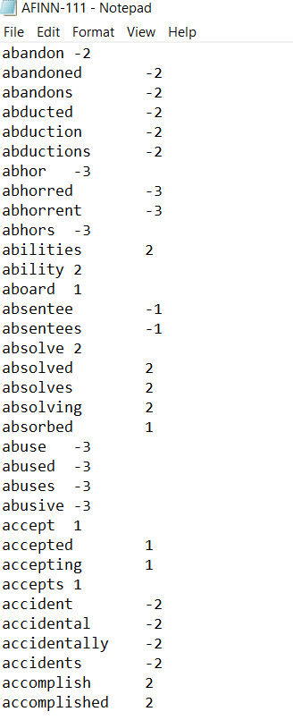
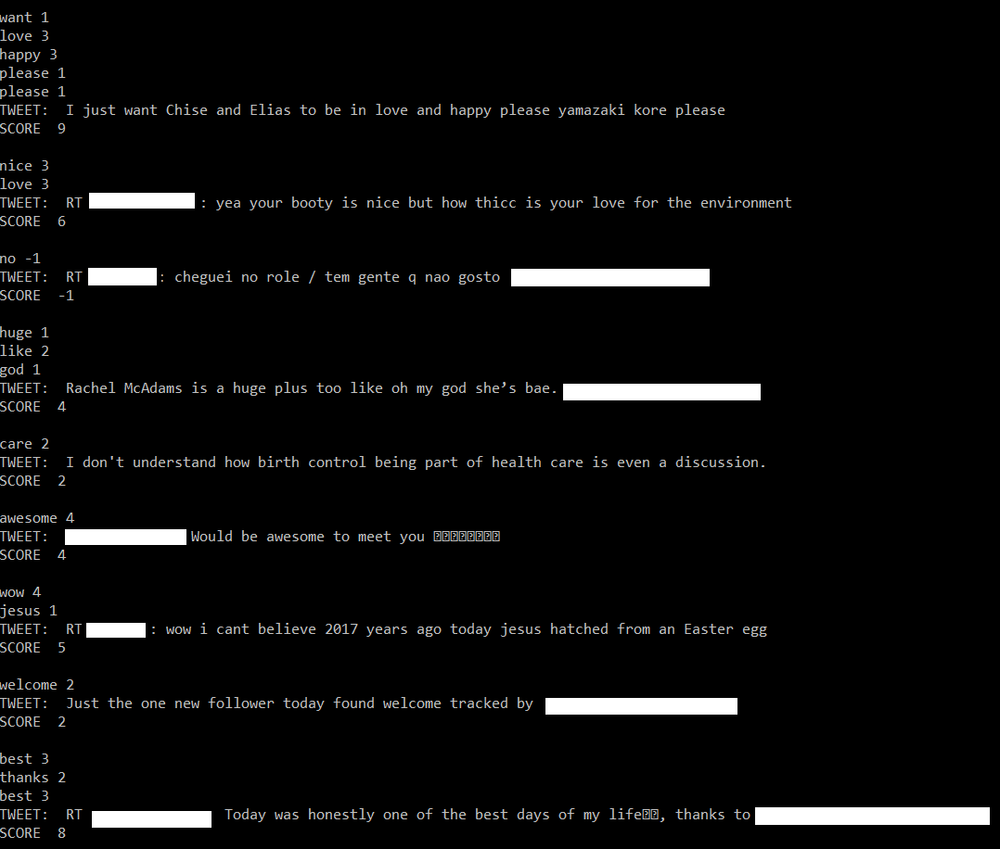

# ds_twitter_sentiment
Get a live stream of tweets into a SQLite DB and perform sentiment analysis
The assignment has 2 parts:

1. Save a stream of tweets
2. Perform sentiment analysis

Here is the corpus of words and sentiment used to derive sentiments from a stream of tweets:
 
 
This is an example of the output - individual words, tweets and their sentiment scores:
 
